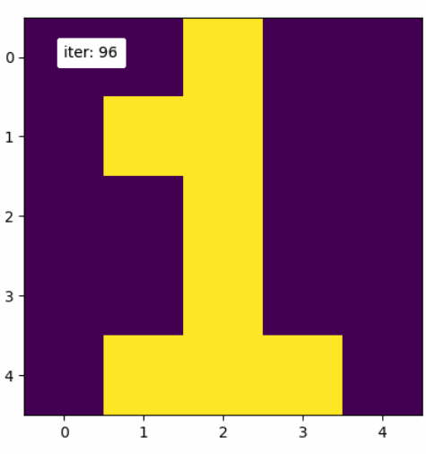
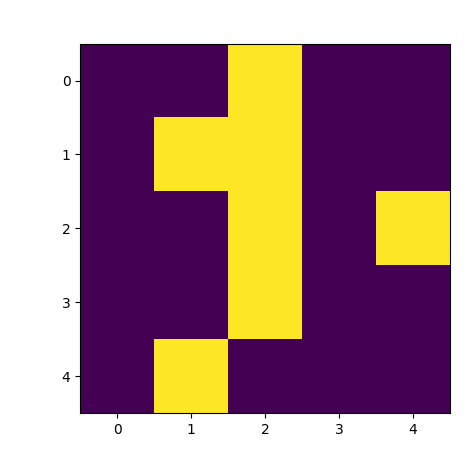
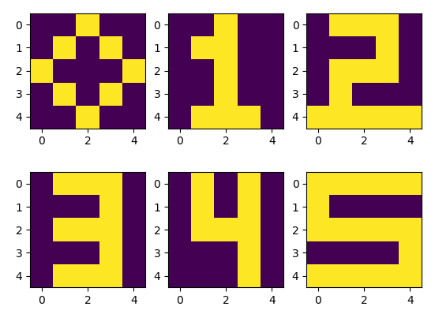
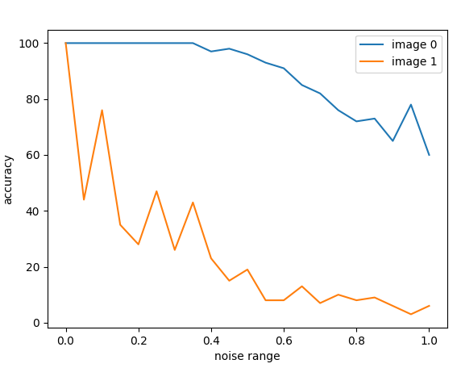
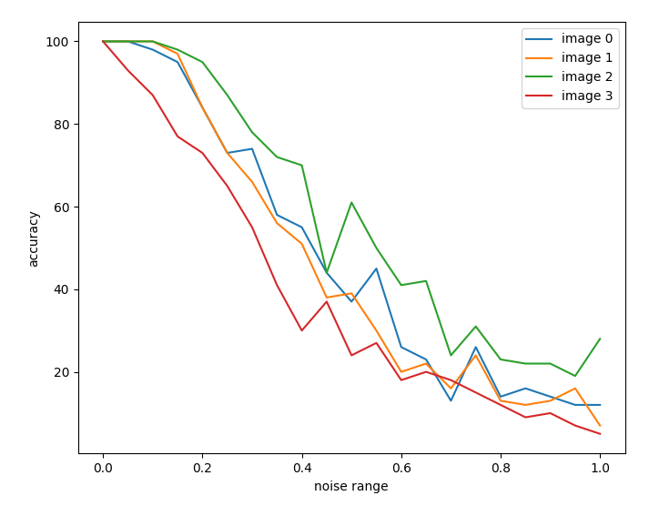
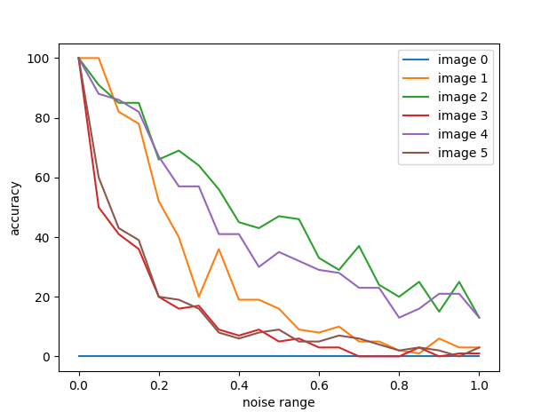

# レポート課題１

- Copilotについて
  - Github Copilotをもちいてプログラムの一部を作成しています
  - 主にlib.pyの部分を支援してもらいました(学習データの画像配列生成部分はCopilotに全て任せました)
  - main.pyの学習アルゴリズムの部分もコメントからかけるか試してみましたが、講義の内容と異なったアルゴリズムを書いていたため使用しませんでした（すべてのニューロンを同時に更新するプログラムが提案された）
  - まだ不安定さやCopilotが覚えているコードも誤った内容があるため、出力した内容を疑って見る必要があると感じました

## 課題1. 

>  Hopfield型のニューラルネットをシミュレートするプログラムを作り，まず1種類の5x5の2値(+1/-1)画像を覚えさせ，元画像にノイズ(5~20%の一通り)を加えた画像を初期値として想起する実験をせよ．

以下のような数字の１の画像を学習させた
| デフォルト |  20%ノイズを付与した例 |
| --- | --- |
| |  |


結果、20％までノイズを付与していったが、すべて100％の正答率で想起できた。

main.pyのproblem1()の実行結果
```sh
acc:  1.0 at 0.05
acc:  1.0 at 0.06
acc:  1.0 at 0.07
acc:  1.0 at 0.08
acc:  1.0 at 0.09
acc:  1.0 at 0.1
acc:  1.0 at 0.11
acc:  1.0 at 0.12
acc:  1.0 at 0.13
acc:  1.0 at 0.14
acc:  1.0 at 0.15
acc:  1.0 at 0.16
acc:  1.0 at 0.17
acc:  1.0 at 0.18
acc:  1.0 at 0.19
acc:  1.0 at 0.2
acc:  1.0 at 0.21
acc:  1.0 at 0.22
acc:  1.0 at 0.23
acc:  1.0 at 0.24
acc:  1.0 at 0.25
acc:  1.0 at 0.26
acc:  1.0 at 0.27
acc:  1.0 at 0.28
acc:  1.0 at 0.29
```


## 課題2
>  同条件で画像の種類を6程度まで徐々に増やして想起性能を調べよ．また，画像が2種類と4種類の場合について，ノイズを0％から100％（50%以上の意味は何か？）まで徐々に増やして想起性能を調べよ．

いかの6枚の画像を学習データとして使用した


### ２枚を学習させた場合(0,1を学習)


### 4枚で学習させた場合（0,1,2,3を学習）


### 6枚で学習させた場合


50%以上ノイズを付与した場合、その画像には元の画像のデータよりもランダムなデータのほうが増えるので、画像が入力を識別するための情報として機能しなくなり、正しい画像を選択して想起することができなくなる。なので、50%以上のノイズを付与した場合の想起率は、入力画像から最も近い情報を記憶から想起しているということができると考えた


## 考察

- 今回のホップフィールドネットワークの想起率は $0.138N = 3.45$ということで、約3枚の画像を記憶できることが知られている
- 課題2で6枚の画像を記憶させてプロットさせたが、一部全く想起できない画像が存在したり、ノイズ率が増えると急激に想起率が下がることがわかり、あまり学習がうまく行っていないようにも感じた
- 入力画像どうしの違いやパターンなども考慮し、より性能を伸ばすにはどうすればよいかを考える必要があると感じた
